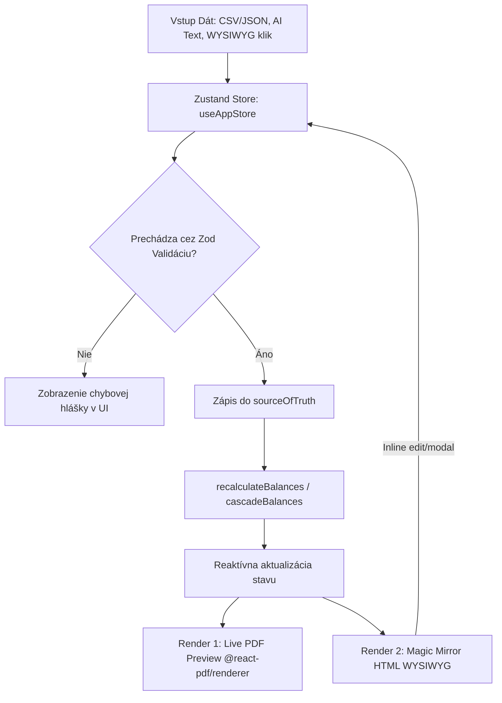

# Architektonický a Vývojársky Blueprint: VÚB Statement Generator

Tento dokument poskytuje detailný a vyčerpávajúci technický popis architektúry, dátových tokov, matematických prepočtov, pamäťových optimalizácií a testovacieho dizajnu aplikácie **VÚB Statement Generator** (stav k **26. júnu 2026**). Slúži ako hlavná príručka pre vývojárov na udržanie integrity kódu, predchádzanie regresiám a prípadné znovupostavenie aplikácie od základu.

---

## 1. Architektonická Filozofia

Aplikácia je postavená ako moderná, klientska Single Page Aplikácia (SPA) s offline-first architektúrou (PWA) používajúca nasledujúci technologický stack:
*   **Core UI / Logic:** React v18.2 + TypeScript v5.3 + Vite v5.0.
*   **State Management:** Zustand v4.5 (využívajúci selektory a plytké porovnávanie `shallow` na zabránenie nadbytočným re-renderom).
*   **Dátová Validácia:** Zod v3.22 (definuje striktnú schému pravdy - Single Source of Truth).
*   **Generovanie PDF:** `@react-pdf/renderer` v3.4 (deklaratívne generovanie PDF priamo v runtime prehliadača pomocou skutočných vektorových elementov, bez rasterizácie na plátno).
*   **PWA a Servisný Pracovník:** `vite-plugin-pwa` (nakonfigurovaný v režime `generateSW` pre kompletné lokálne kešovanie statických zdrojov vrátane sieťových fontov).
*   **Doplnkové nástroje:** `jszip` (na zostavenie ZIP balíka vo vlákne prehliadača) a `papaparse` (na rýchle, streamované spracovanie CSV súborov).

Aplikácia dôsledne oddeľuje dátovú vrstvu (Zustand + Zod) od prezentačnej vrstvy (HTML šablóna pre editor a PDF komponenty pre tlač).



---

## 2. Dátový Model (Single Source of Truth)

Celá aplikácia je riadená jednou striktnou schémou `SourceOfTruthSchema` definovanou v [sourceOfTruth.ts](file:///Users/erikbabcan/AAAPDF/src/schema/sourceOfTruth.ts). Akákoľvek hodnota pred zápisom do Zustand storu prechádza touto schémou.

### Štruktúra schémy (Zod schema):
1.  **`TransactionSchema`:**
    *   `id` (string, optional): Unikátny identifikátor transakcie.
    *   `date_realiz` (string): Dátum zaúčtovania / realizácie (musí byť neprázdny, očakávaný formát `DD.MM.YYYY` alebo `DD.MM` v závislosti od pôvodu importu).
    *   `date_valuta` (string): Dátum valuty (neprázdny).
    *   `amount` (number): Číselná suma transakcie (kladné číslo pre príjmy/kredity, záporné číslo pre výdavky/debety).
    *   `account` (string, optional): Číslo účtu / IBAN protistrany.
    *   `popis` (string, optional): Detailný popis transakcie (názov protistrany, referencia platiteľa, správa pre príjemcu).
    *   `vs`, `ks`, `ss` (string, optional): Variabilný, konštantný a špecifický symbol (striktne overované na prítomnosť iba číselných znakov v čistiacich funkciách).
    *   `type` (string, optional): Klasifikácia pohybu (`incoming` / `outgoing`).
2.  **`ClientDataSchema`:**
    *   `client_title` (string): Názov firmy alebo meno klienta (povinné).
    *   `client_street`, `client_zip`, `client_city` (string): Kompletná adresa klienta (povinná).
    *   `client_iban` (string): IBAN účtu klienta (minimálne 15 znakov, overovaný formát).
    *   `client_swift` (string): SWIFT/BIC kód prislúchajúcej banky (minimálne 8 znakov).
    *   `client_account` (string, optional): Názov balíka služieb (napr. *VÚB Biznis účet Štandard*).
    *   `client_id` (string, optional): Identifikačné číslo klienta (IČO alebo rodné číslo).
    *   `client_limit` (string, optional): Limit povoleného prečerpania (napr. `0,00`).
3.  **`StatementDataSchema`:**
    *   `period_start`, `period_end` (string): Časové vymedzenie výpisu.
    *   `statement_number` (string): Poradové číslo výpisu (napr. `11/2025`).
    *   `statement_date` (string, optional): Dátum vyhotovenia výpisu.
    *   `statement_currency` (string, optional): Mena účtu (napr. `EUR`).
    *   `statement_month`, `statement_year` (string, optional): Rozdelené mesačné a ročné zložky pre potreby sekvenčného a dávkového radenia.
4.  **`BankDataSchema`:**
    *   `bank_logo_id` (string): Identifikátor loga banky (napr. *VÚB BANKA Intesa Sanpaolo Group*).
    *   `bank_logo_image` (string, optional): Base64 kód vlastného obrázkového loga.
    *   `bank_register_info` (string): Obchodno-registračné údaje banky (sídlo, súd, vložka, IČO).
    *   `bank_outlet_id` (string): Kód pobočky (napr. `30017`).
    *   `bank_outlet_address` (string): Textová adresa pobočky.
5.  **`BalancesSchema`:**
    *   `opening_balance` (number): Počiatočný zostatok účtu na začiatku obdobia.
    *   `closing_balance` (number): Konečný zostatok k ultimu obdobia.
    *   `total_credit` (number): Celková suma všetkých prichádzajúcich transakcií (príjmov).
    *   `total_debit` (number): Celková suma všetkých odchádzajúcich transakcií (výdavkov).

---

## 3. Zustand Store a Matematické Prepočty

Všetky zmeny stavu sa uskutočňujú prostredníctvom akcií definovaných v [useAppStore.ts](file:///Users/erikbabcan/AAAPDF/src/store/useAppStore.ts).

### A. Výpočet zostatkov (`recalculateBalances`)
Pri akejkoľvek manipulácii s transakciami (pridanie, úprava, zmazanie, import) store automaticky vyvolá funkciu `recalculateBalances`. Táto funkcia vykonáva nasledujúci deterministický prepočet:

$$\text{total\_credit} = \sum_{t \in \text{transactions}, t.\text{amount} \ge 0} t.\text{amount}$$

$$\text{total\_debit} = \sum_{t \in \text{transactions}, t.\text{amount} < 0} |t.\text{amount}|$$

$$\text{closing\_balance} = \text{opening\_balance} + \text{total\_credit} - \text{total\_debit}$$

Výsledné hodnoty sa zapíšu do `sourceOfTruth.balances`. Ak je aktívny režim `batchMode`, aktualizovaný stav sa okamžite zapíše aj do prislúchajúceho indexu v poli `batchStatements` a následne sa vyvolá kaskáda.

### B. Kaskádový prepočet (`cascadeBalances`)
Pre dávkový generátor (Time-Machine) je kľúčová konzistencia počiatočných a konečných zostatkov naprieč mesiacmi. Algoritmus prechádza celé pole vygenerovaných výpisov lineárne od prvého po posledný:

1.  Pre každý index $i$ od 1 po $N-1$ (kde $N$ je celkový počet mesiacov v dávke):
2.  Zoberie sa konečný zostatok výpisu na indexe $i-1$:
    $$\text{prevClosing} = \text{batchStatements}[i-1].\text{balances}.\text{closing\_balance}$$
3.  Tento zostatok sa nastaví ako počiatočný zostatok pre aktuálny výpis na indexe $i$:
    $$\text{batchStatements}[i].\text{balances}.\text{opening\_balance} = \text{prevClosing}$$
4.  Znovu sa prepočítajú transakcie pre aktuálny mesiac $i$ a vypočíta sa nový konečný zostatok:
    $$\text{batchStatements}[i].\text{balances}.\text{closing\_balance} = \text{prevClosing} + \text{total\_credit}_i - \text{total\_debit}_i$$
5.  Ak je vybraný výpis na časovej osi ten, ktorý bol ovplyvnený kaskádou, zmeny sa okamžite prepíšu aj do aktívneho objektu `sourceOfTruth` na zobrazenie v UI.

Tento algoritmus garantuje matematickú správnosť celej časovej osi. Akákoľvek zmena transakcie v novembri okamžite opraví zostatky v decembri, januári, februári atď.

---

## 4. Interaktívny WYSIWYG Editor (Magic Mirror)

V komponente [RightPanel.tsx](file:///Users/erikbabcan/AAAPDF/src/components/RightPanel.tsx) sa nachádza HTML replika výpisu, ktorá slúži ako plnohodnotný WYSIWYG editor.

### A. Vykresľovanie A4 hárku
HTML maketa je štylizovaná pomocou tried v [fintech.css](file:///Users/erikbabcan/AAAPDF/src/fintech.css). Rozmery hárku sú nastavené na presný A4 pomer strán s vnútornými okrajmi, ktoré verne simulujú PDF rozloženie.

```css
.ft-html-sheet {
  width: 210mm;
  min-height: 297mm;
  padding: 15mm;
  background: #ffffff;
  color: #000000;
  font-family: 'DejaVu Sans', sans-serif;
  position: relative;
  box-shadow: 0 10px 30px rgba(0, 0, 0, 0.15);
}
```

### B. Mechanizmus inline editácie
Všetky textové polia, ktoré reprezentujú dátový model, sú obalené interaktívnou triedou `ft-mirror-editable`.
1.  **Udalosť `onClick`:** Kliknutie na element zachytí jeho sekciu (napr. `client`), kľúč (`client_iban`), popisek a aktuálnu hodnotu. Tento stav zapíše do lokálneho react stavu `editingField`.
2.  **Glassmorphic modal:** Zobrazenie modálneho okna s textovým poľom alebo textareou (v prípade viacriadkového `bank_register_info`).
3.  **Uloženie:** Kliknutím na *Uložiť* sa vyvolá príslušná Zustand akcia (`setBankData`, `setClientData` atď.), čo spustí reaktívny re-render HTML aj PDF náhľadu.

### C. Drag & Drop Logotypu
HTML editor obsahuje drop-zónu pre obrázok loga banky.
*   **Udalosti `onDragOver` a `onDragLeave`:** Správa vizuálneho stavu drop-zóny (pridanie modrého prerušovaného okraja a prekrytia).
*   **Udalosť `onDrop`:** Získanie prvého súboru z `e.dataTransfer.files`. Pomocou `FileReader` s metódou `readAsDataURL` sa obrázok asynchrónne načíta a skonvertuje do Base64 stringu.
*   Tento string sa zapíše do `bank.bank_logo_image`. Ak je prítomný, renderuje sa namiesto textového loga ako v HTML šablóne, tak aj v `@react-pdf` komponente cez `<Image src={bank.bank_logo_image} />`.

---

## 5. AI Extrakčný Asistent (Mistral Client)

V knižnici [mistralClient.ts](file:///Users/erikbabcan/AAAPDF/src/lib/mistralClient.ts) je naimplementovaná komunikácia s Mistral AI modelmi.

### A. Konfigurácia API dopytu
Komunikácia prebieha napriamo bez serverovej infraštruktúry (direct client-to-API request):
*   **Endpoint:** `https://api.mistral.ai/v1/chat/completions`
*   **JSON Mode:** Vo fetch requeste je zasielaný parameter `response_format: { type: 'json_object' }`. To zaručuje, že model Mistral vráti čistý JSON objekt bez markdown syntaxe.
*   **Temperature:** Nastavená na prísnych `0.1` na minimalizáciu kreativity modelu a maximalizáciu deterministickej extrakcie faktov a čísel.

### B. Systémový Prompt a pravidlá extrakcie
Systémový prompt obsahuje presnú definíciu očakávanej JSON štruktúry a striktné typové pravidlá:
1.  **Dátumy:** Musia byť striktne vo formáte `DD.MM.YYYY`.
2.  **Symboly (VS, KS, ŠS):** Musia byť očistené od akýchkoľvek nečíselných znakov (odstránenie písmen, lomiek, medzier).
3.  **Suma (amount):** Musí byť vrátená ako číselná hodnota (float). Výdavky/debety musia mať striktne záporné znamienko (`-`), príjmy kladné.

### C. Mapovanie a čistenie dát (`mapJsonTransactions`)
Keďže výstupy z rôznych bánk môžu mať mierne odlišné pomenovania stĺpcov, funkcia `mapJsonTransactions` v `LeftPanel.tsx` normalizuje vlastnosti transakcií:
*   Mapuje názov dátumu z alternatívnych kľúčov: `transfer_confirmed_date`, `date_realiz`, `Date`, `date`.
*   Rozpoznáva smer platby: Ak má objekt kľúč `transfer_type: 'outgoing'`, suma sa vynásobí `-1` na zabezpečenie zápornej hodnoty v našej schéme, zatiaľ čo `incoming` zostáva kladný.

---

## 6. Rendering PDF a správa fontov

Komponent `<StatementDocument>` v `RightPanel.tsx` kompiluje PDF dokument.

### A. Podpora slovenských znakov (Latin Extended) a diakritiky
Štandardné fonty zabudované v PDF prehliadačoch (Helvetica, Times) nepodporujú plne slovenské diakritické znamienka (ako napr. ľ, š, č, ť, ž, ô, ä). Na vyriešenie chýbajúcich znakov a "štvorčekov" pri generovaní, aplikácia využíva lokálne naítavané open-source fonty **DejaVu Sans** a **DejaVu Sans Mono**.
*   Aplikácia pri štarte dynamicky registruje tieto písma zo statického adresára `/fonts/`:
    ```typescript
    Font.register({
      family: 'DejaVu Sans',
      fonts: [
        { src: '/fonts/DejaVuSans.ttf', fontWeight: 400 },
        { src: '/fonts/DejaVuSans-Bold.ttf', fontWeight: 700 }
      ]
    });
    Font.register({
      family: 'DejaVu Sans Mono',
      fonts: [
        { src: '/fonts/DejaVuSansMono.ttf', fontWeight: 400 },
        { src: '/fonts/DejaVuSansMono-Bold.ttf', fontWeight: 700 }
      ]
    });
    ```
*   Týmto prístupom sa plne eliminujú problémy so sťahovaním či subsetovaním Google fontov. Pre layout je nastavený jemný padding `15mm` a veľkosť písma `7` až `8`, aby výsledný generát zabezpečil konzistentné a presné zobrazenie na **4 stranách** podľa vzoru originálu banky.

### B. Vizuálne replikačné prvky
Pre zaistenie 100% zhodnosti s originálnym dokumentom VÚB banky sú implementované tieto špecifické dizajnové detaily:
1.  **Sidebar tracker:** Na ľavom okraji strany je vertikálne umiestnený kódovací token (napr. `KORPELE_XDA_20251128322528_120XP.DAT...`). Vykresľuje sa pomocou absolútneho poziciovania a otočenia o -90 stupňov:
    ```typescript
    style={{ 
      position: 'absolute', 
      bottom: 30, 
      left: 15, 
      transformOrigin: 'left bottom', 
      transform: 'rotate(-90deg)', 
      fontSize: 5 
    }}
    ```
2.  **Právne doložky:** V spodnej časti dokumentu je presný právny text o ochrane vkladov podľa zákona č. 118/1996 Z.z. a kontaktné informácie.
3.  **Číslovanie strán v runtime:** `@react-pdf` nepovoľuje statické počítanie strán. Číslovanie strán sa dynamicky dopočítava pomocou funkcie render v komponente `<Text>`:
    ```typescript
    render={({ pageNumber, totalPages }) => `${pageNumber}/${totalPages}`}
    ```

---

## 7. Pamäťovo bezpečný ZIP Export (Batch Export)

Hromadné generovanie veľkého množstva PDF dokumentov (napríklad 12 mesiacov) na strane klienta je extrémne náročné na pamäť a procesor. Bez optimalizácií dochádza k zahlteniu JS Heap pamäte a prehliadač proces ukončí chybou.

### A. Batch processing (Dávkovanie po 3 kusoch)
Namiesto spustenia generovania pre všetky výpisy naraz (`Promise.all` na celé pole) spracováva funkcia `handleDownloadZip` položky v slučke po menších častiach určených konštantou `BATCH_SIZE = 3`:

```typescript
for (let i = 0; i < total; i += BATCH_SIZE) {
  const chunk = batchStatements.slice(i, i + BATCH_SIZE);
  const pdfPromises = chunk.map(async (s, idxInChunk) => {
    const blob = await pdf(<StatementDocument sourceOfTruth={s} />).toBlob();
    return { name: `Vypis_${safeName}.pdf`, blob };
  });
  const results = await Promise.all(pdfPromises);
  results.forEach(({ name, blob }) => {
    zip.file(name, blob, { binary: true });
  });
}
```
Týmto spôsobom je v jednom momente v operačnej pamäti alokovaný maximálne 3 vygenerované PDF bloby. Staré referencie sú po skončení cyklu uvoľnené pre garbage collector.

### B. Streamovanie a kompresia ZIP súboru
Na zaistenie plynulého zápisu veľkého množstva dát bez pádov aplikácia konfiguruje `jszip` na streamovaný zápis a stredný stupeň kompresie `DEFLATE` (level 6), ktorý vyvažuje rýchlosť spracovania s veľkosťou výsledného archívu.

### C. Pamäťový audit pred exportom
Pred začatím generovania ZIP archívu aplikácia zanalyzuje limity prehliadača:
1.  **Odhad alokácie:** Každý mesiac spotrebuje priemerne 5 MB pamäte pre surový PDF Blob + 2.5 MB réžiu renderera. Odhadovaná pamäť sa vypočíta ako:
    $$\text{estimatedMemory} = \text{batchStatements.length} \times 7.5 \text{ MB}$$
2.  **Kontrola limitu:** Cez API prehliadača `performance.memory.jsHeapSizeLimit` sa zistí celková dostupná pamäť pre JS proces.
3.  Ak vypočítaný odhad prekročí 70 % dostupného limitu, export sa zablokuje a používateľovi sa v dialógu odporučí znížiť počet mesiacov.

---

## 8. Testovacia infraštruktúra (Zero Regressions)

Aplikácia dosahuje stabilný chod bez regresií vďaka rozsiahlej sade unit a integračných testov.

Aplikácia vynucuje nulovú regresiu kódu pomocou **103 prísnych automatizovaných testov** spúšťaných v prostredí Vitest:

### A. Snapshot Testy PDF Štruktúry (`StatementDocument.test.tsx`)
Keďže generovaný súbor je binárny PDF, klasické HTML porovnávanie nefunguje. Používame `react-test-renderer` na transformáciu `@react-pdf` komponentov na JSON štruktúru:
*   Test overuje prítomnosť kľúčových textových uzlov (napr. *VÝPIS Z ÚČTU*, IBAN klienta, sumy transakcií) v dekódovanom JSON strome.
*   Zabraňuje to neúmyselným zmenám v štruktúre dokumentu alebo rozložení tabuliek pri refaktoringu štýlov.

### B. Pamäťové Profilovanie (`MemoryProfiler.test.ts`)
Tento test simuluje intenzívne používanie aplikácie na overenie únikov pamäte:
*   Spúšťa 500 opakovaných cyklov zmien transakcií a následných kaskádových prepočtov (`cascadeBalances`) pre 50-mesačnú časovú os.
*   Meria pamäťový delta prírastok pred a po vykonaní cyklov. Test zaručuje, že pamäťový nárast po 500 cykloch nepresiahne 15 MB, čo potvrdzuje absenciu pamäťových únikov (memory leaks) v Zustand store a react-pdf registrácii.

### C. Live Integration Testy (`mistralClient.live.test.ts`)
*   Testuje skutočné sieťové dopyty na API Mistral.
*   Obsahuje ochranu: Ak test beží v sandbox prostredí bez internetového pripojenia (napr. niektoré CI/CD potrubia), test sa automaticky preskočí s výpisom informácie namiesto zlyhania celého buildu.
